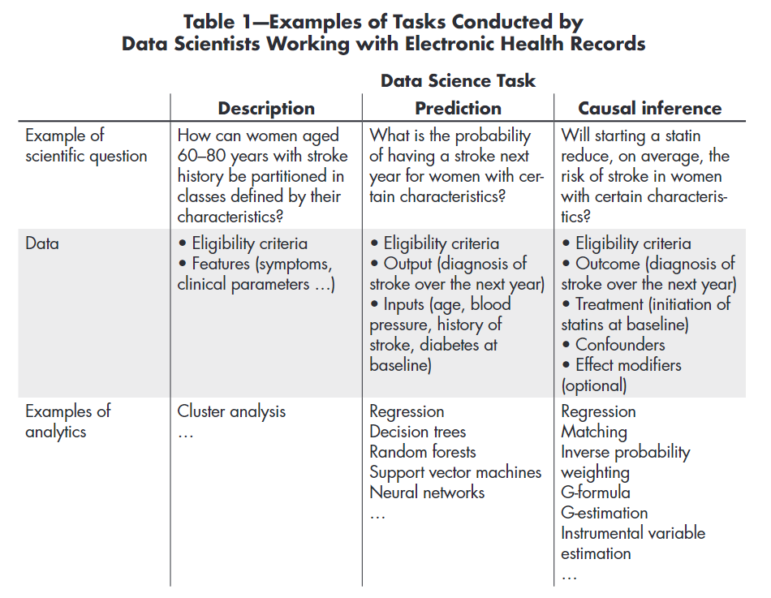

```{r setup, include=FALSE}
knitr::opts_chunk$set(echo = TRUE, include = params$solutions)
```

# Introduction to Causal Inference

1.  What is the goal of causal inference?

```{asis, include = !params$solutions}
\
\
\
\
\
\
\
\
\
\
\
\
\
```

```{asis}
The goal of causal inference is to estimate the effect of changing one variable (the treatment) on another variable (the outcome). 

Example: In Major League Baseball, should the home team's first batter bunt when the game is tied?

Treatment: Bunt

Outcome: Home Team wins
```

2.  How is causation different from correlation (i.e. an association)?

```{asis, include = !params$solutions}
\
\
\
\
\
\
\
\
\
\

```

```{asis}
Association is about what we *see*.  Causation is if we *do* something.

Example: In the 2021-22 seasons, the home team came to the plate XX times with the game tied in extra innings.  When the home team bunted (add percent), they went on to win the game YY.  When the home team swung away (add percent), they went on to win the game ZZ.


**Insert table here with basic results.**

This is correlation...it's what we observed.  Not causation because the bunters are fundamentally different from the nonbunters.
```



\newpage

# Fundamentals of Causal Inference

Traditional conditional probability notation cannot distinguish between causation and association.

\
\
\
\
\
\
\
\
\
\
\
\
\
\

\newpage

## Counterfactuals and the Potential Outcomes Framework

\
\
\
\
\
\
\
\
\
\
\
\
\
\
\
\
\
\

## Confounding

\
\
\
\
\
\
\
\
\
\
\
\
\
\

\newpage

## Causal Diagrams

\
\
\
\
\
\
\
\
\

1.  Confounding

\
\
\
\
\
\
\
\

2.  Collider

\
\
\
\
\
\
\
\
\

\newpage

## Assumptions of Causal Inference

* SUTVA (Stable Unit Treatment Value Assumption)

```{asis, include = !params$solutions}
\
\
\
\
\
```

```{asis}
The potential outcome for any unit is unaffected by the treatment assignment of other units.
```

* Ignorability

```{asis, include = !params$solutions}
\
\
\
\
\
\
\
```

```{asis}
Treatment assignment is independent of potential outcomes, given a set of observed covariates.
```

* Positivity

```{asis, include = !params$solutions}
\
\
\
\
\
\
\
```


```{asis}
Every unit has a positive probability of receiving each treatment level, ensuring that the causal effect is estimable for all levels of covariates.
```


\newpage

# Methods for Causal Inference

## Matching

\
\
\
\
\
\
\
\
\
\
\
\
\
\
\
\


## Propensity Score Matching

\
\
\
\
\
\
\
\
\
\
\
\
\
\
\
\


## Stratification on the Propensity Score

\
\
\
\
\
\
\
\
\
\
\
\
\
\
\
\

## Inverse Probability of Treatment Weighting

\
\
\
\
\
\
\
\
\
\
\
\
\
\
\
\


## Covariate Adjustment Using the Propensity Score

\
\
\
\
\
\
\
\
\
\
\
\
\
\
\
\


# Applications

\*\* add slides \*\*

# References

-   Austin, P.C., 2011. An introduction to propensity score methods for reducing the effects of confounding in observational studies. Multivariate behavioral research, 46(3), pp.399-424.

-   Hernán MA, Robins JM (2020). Causal Inference: What If. Boca Raton: Chapman & Hall/CRC.

-   Hernán, M. A., Hsu, J., & Healy, B. (2019). A Second Chance to Get Causal Inference Right: A Classification of Data Science Tasks. CHANCE, 32(1), 42–49. https://doi.org/10.1080/09332480.2019.1579578

-   Cummiskey, K., Villanti, L., and Crofford, I. (2024). Bunting and the ghost runner: a causal inference approach. https://arxiv.org/abs/2404.06587

-   Chesnaye, N. C., Stel, V. S., Tripepi, G., Dekker, F. W., Fu, E. L., Zoccali, C., & Jager, K. J. (2021). An introduction to inverse probability of treatment weighting in observational research. Clinical kidney journal, 15(1), 14–20. https://doi.org/10.1093/ckj/sfab158


