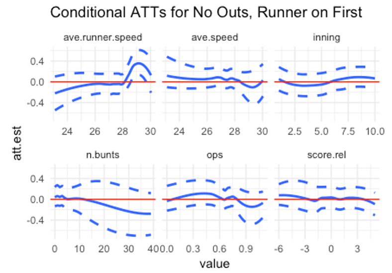
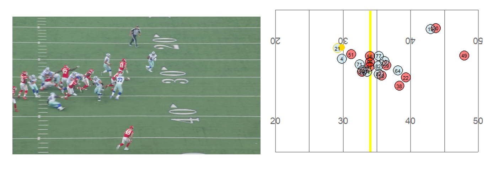
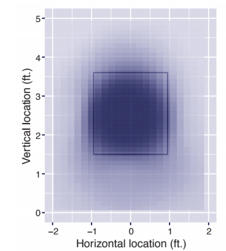
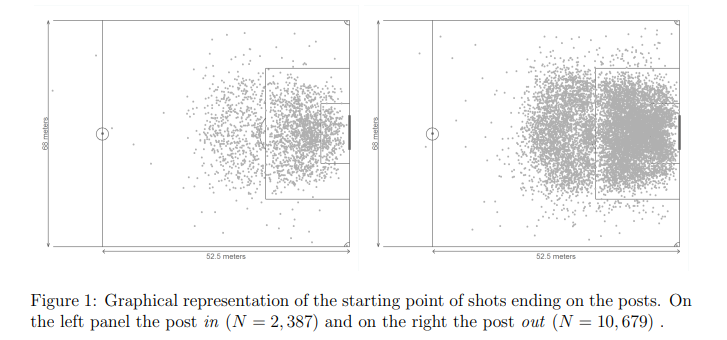

```{r setup, include=FALSE}
knitr::opts_chunk$set(echo = TRUE, include = params$solutions)
```


For this handout and some R code, please go here:

{width=250}

github

user: kfcaby

repo: UCSAS_causal_inference_workshop

\newpage


# Introduction to Causal Inference

1.  What is the goal of causal inference?


\newpage

2.  How is causation different from correlation (i.e. an association)?


\newpage


\newpage

# Fundamentals of Causal Inference

Traditional conditional probability notation cannot distinguish between causation and association. We need to introduce different notation to express causation.


\newpage

## Counterfactuals and the Potential Outcomes Framework

\newpage

## Confounding

\newpage

## Causal Diagrams

\
\
\
\
\
\
\
\
\

1.  Confounding

\
\
\
\
\
\
\
\
\
\
\
\
\
\

2.  Collider

\
\
\
\
\
\
\
\
\

\newpage

## Assumptions of Causal Inference

* SUTVA (Stable Unit Treatment Value Assumption)

```{asis, include = !params$solutions}
\
\
\
\
\
\
\
\
\
\
\
\
\
\
\
```

```{asis}
The potential outcome for any unit is unaffected by the treatment assignment of other units.
```

* Ignorability

```{asis, include = !params$solutions}
\
\
\
\
\
\
\
\
\
\
\
\
\
\
\
\
\
```

```{asis}
Treatment assignment is independent of potential outcomes, given a set of observed covariates.
```

* Positivity

\newpage


```{asis}
Every unit has a positive probability of receiving each treatment level, ensuring that the causal effect is estimable for all levels of covariates.
```


\newpage

# Methods for Causal Inference

## Matching

\newpage

## Propensity Score Matching

\newpage

## Stratification on the Propensity Score

\newpage

## Inverse Probability of Treatment Weighting

\newpage

## Covariate Adjustment Using the Propensity Score

\newpage


# Applications


### Estimating how the bunting effect varies 

Authors: Katherine Evans and Michael Lopez

Title: Treatment Effect Heterogeneity in MLB Bunting Strategies

Where: JSM 2019



\newpage

### Player effects using location data

Author: Michael Lopez

Title: Building Blocks for Estimating Causal Effects of Athlete Behavior in Football and Hockey Using Player Tracking Data

Where: JSM 2019

Using player location data, we can better estimate player effects by comparing players in similar situations.

See also http://www.lukebornn.com/papers/fernandez_ssac_2018.pdf by Fernandez and Bornn for soccer.



\newpage

### Catcher framing 

Authors: Marchi, Albert, Baumer

Title: Analyzing Baseball Data with R

Where: Chapter 7



\newpage

### Player rewards

Authors: Romain Gauriot and Lionel Page

Title: Fooled by performance randomness: over-rewarding
luck

Where: Review of Economics and Statistics, 2019



# References

-   Austin, P.C., 2011. An introduction to propensity score methods for reducing the effects of confounding in observational studies. Multivariate behavioral research, 46(3), pp.399-424.

-   Chesnaye, N. C., Stel, V. S., Tripepi, G., Dekker, F. W., Fu, E. L., Zoccali, C., & Jager, K. J. (2021). An introduction to inverse probability of treatment weighting in observational research. Clinical kidney journal, 15(1), 14–20. https://doi.org/10.1093/ckj/sfab158

-   Cummiskey, K., Villanti, L., and Crofford, I. (2024). Bunting and the ghost runner: a causal inference approach. https://arxiv.org/abs/2404.06587

-   Hernán MA, Robins JM (2020). Causal Inference: What If. Boca Raton: Chapman & Hall/CRC.

-   Hernán, M. A., Hsu, J., & Healy, B. (2019). A Second Chance to Get Causal Inference Right: A Classification of Data Science Tasks. CHANCE, 32(1), 42–49. https://doi.org/10.1080/09332480.2019.1579578


